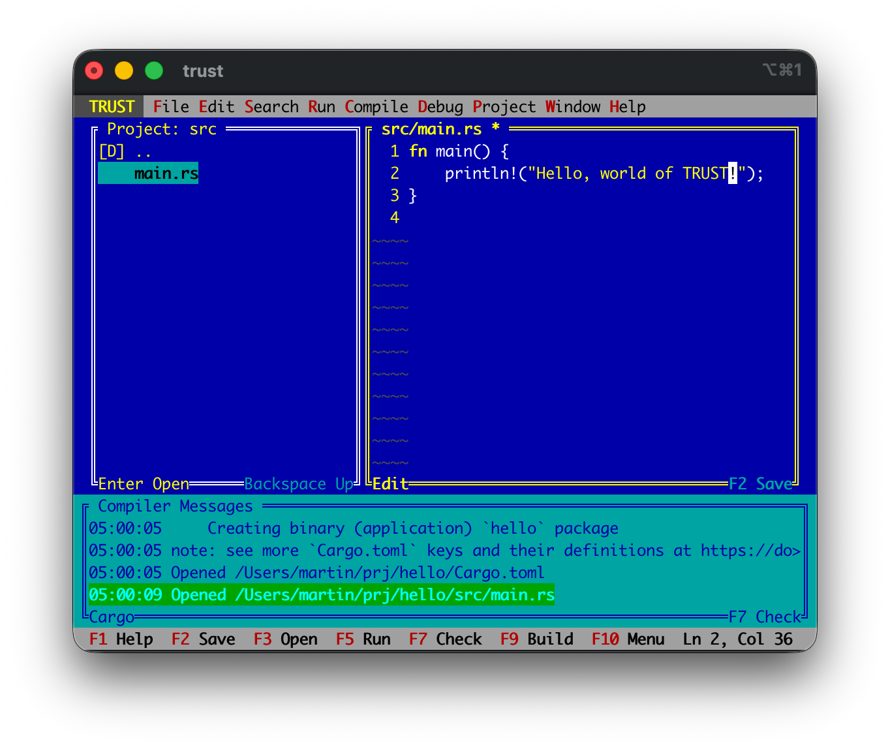
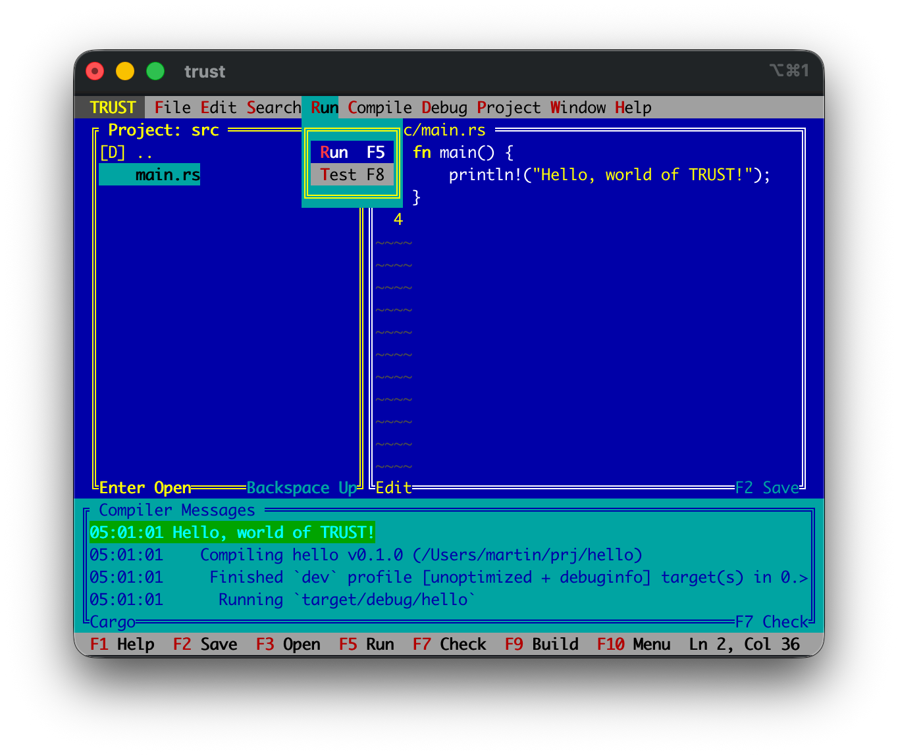
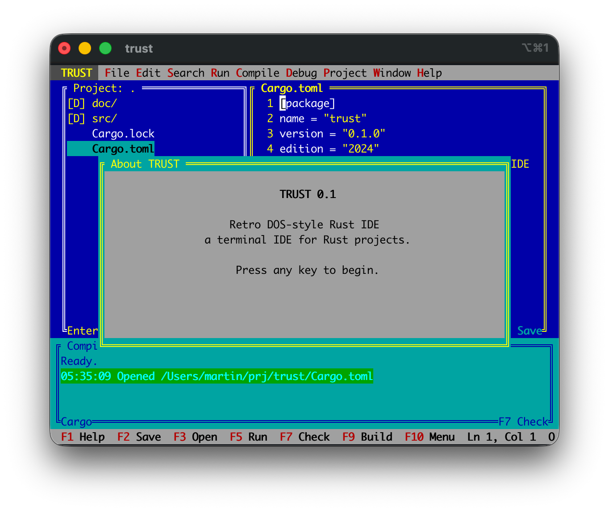
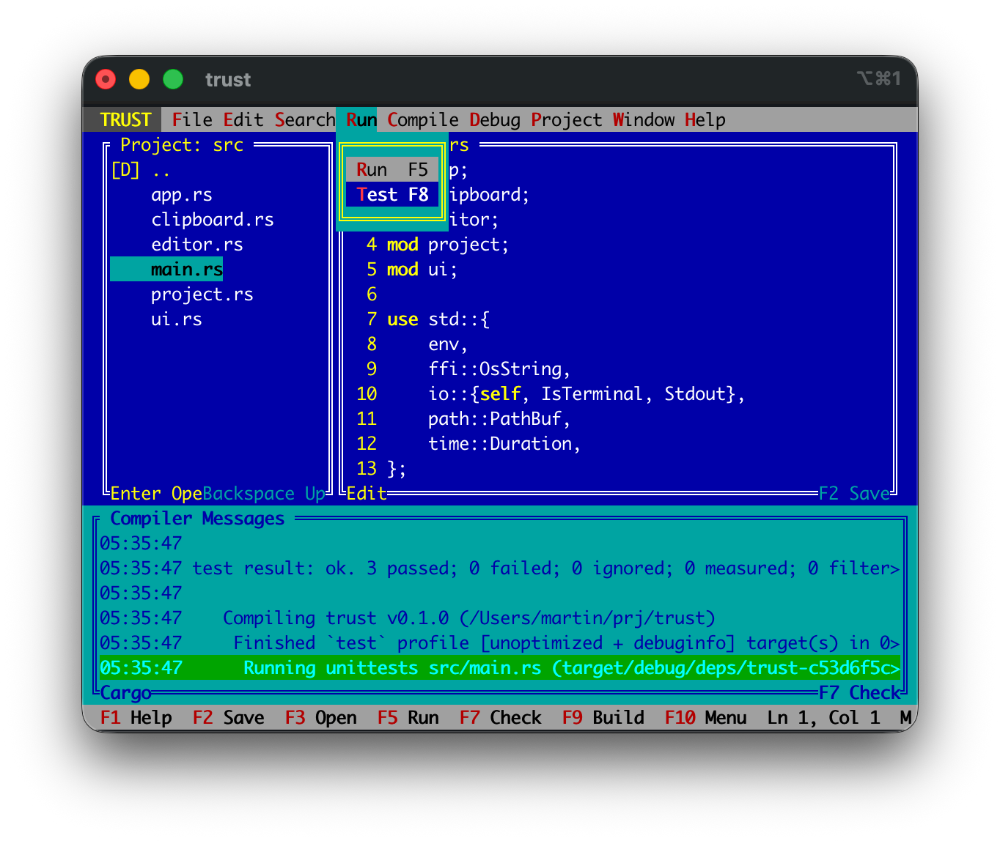

# TRUST

TRUST is a retro TUI IDE for Rust projects inspired by classic blue-screen DOS
development environments.

Status: experimental nostalgia project. It edits files, browses Rust projects,
and runs Cargo commands.

## Screenshots

Building and running "Hello World" in TRUST.

| Starting a project | Running a console program |
| --- | --- |
|  |  |

TRUST can build TRUST.

| TRUST Editor | Running Tests |
| --- | --- |
|  |  |

## FAQ

**Why?**  
Because Rust deserves a blue-screen IDE from the olden days and someone had to do this.

**Does it save my files?**  
Yes. Use `F2` or `Ctrl+S`. TRUST marks dirty buffers with `*` in the editor title. Still, this is more of a fun project so use at your own risk.

**Is this affiliated with any classic DOS IDE vendor?**  
No. TRUST is an independent nostalgia project inspired by classic DOS development environments.

## Run

```sh
cargo run -- /path/to/rust/project
```

If no path is supplied, TRUST opens the current directory.

## Keys

- `F1`: help
- `F2` / `Ctrl+S`: save
- `F3` / `Ctrl+O`: open selected file
- `Backspace`: go to the parent directory in the project pane
- `F4` / `Tab` / `Ctrl+F`: cycle focus
- `F5` / `Ctrl+R`: `cargo run`
- `F7`: `cargo check`
- `F8` / `Ctrl+T`: `cargo test`
- `F9` / `Ctrl+B`: `cargo build`
- `F10`: open the menu bar
- `Ctrl+Z`: undo
- `Ctrl+Y` / `Ctrl+Shift+Z`: redo
- `Ctrl+C`: copy selected text
- `Ctrl+V`: paste clipboard text
- `Ctrl+X`: cut selected text
- `Esc` / `Ctrl+Q`: quit
- `Alt+X`: delete line
- `Alt+U`: duplicate line
- `Shift+Navigation`: select text

## Menus

- `F10` opens the menu bar.
- Left/right arrows switch menus.
- Up/down arrows move through a dropdown.
- `Enter` activates the highlighted menu item.
- `Esc` closes the menu.
- Mouse clicks on the menu bar and dropdown items work too.
- `Edit` now includes `Undo` and `Redo`.
- `File > New` asks for a filename and creates it in the current project pane
  directory.
- `Project > New project` opens the Cargo project dialog with parent directory,
  project name, and `bin` / `lib` selector.
- `Window` switches between panes and contains the former focus option.

## Mouse

- Click inside the editor to move the cursor.
- Drag inside the editor to select text.
- Click inside the project pane to open editable files or navigate directories.
- Click inside any pane to focus it.
- Drag the vertical divider between project and editor panes to resize them.
- Drag the top border of the compiler/message pane to resize it.
- Scroll inside the project, editor, or message pane to move through content.

The project pane lists directories plus editable Rust and Cargo-related files
such as `.rs`, `.toml`, and `.lock`, while skipping `.git`, `target`, and common
editor/build directories. Compiler output is captured in the bottom pane.
